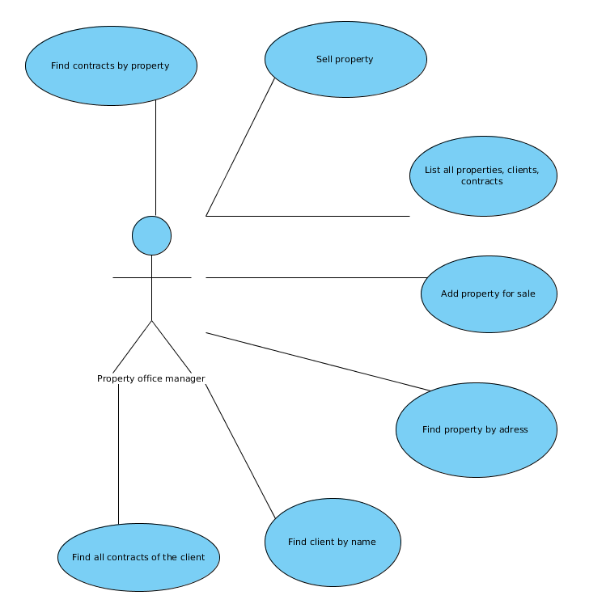
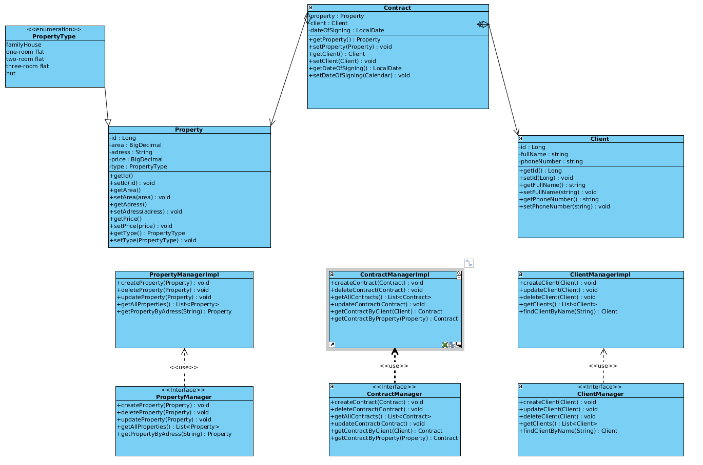

# PV168 - evidencia nehnuteľností
Táto aplikácia predstavuje jednoduchú simuláciu systému pre realitnú spoločnosť.
Umožňuje evidenciu majetku, klientov a predajných zmlúv s možnosťou vyhladávania,
podľa parametrov, ktoré budú neskôr upresnené.

## Súčasný progres
- [x] Finálny push class, use case diagramov; vyplnenie README.md
- [x] Vytvorenie testov pre aplikáciu
- [x] Implementácia backendu
    - [x] Implementácia Client Managera
    - [x] Implementácia Property Managera
    - [x] Implementácia Contract Managera
- [x] Vytvorenie webového rozhrania
- [ ] Finálna verzia projektu
    - [x] Logovanie aplikačnej vrstvy
    - [X] Lokalizácia do troch jazykov
    - [x] Uloženie konfigurácie databázy do .properties súboru
    - [x] Grafické rozhranie
    - [X] Rozdelenie aplikácie do vlákien

## Autori
- Michal Stolárik
- Martin Balucha

## Use Case Diagram

## Class Diagram

